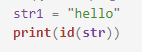
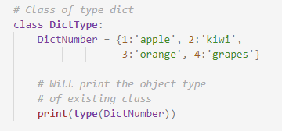

An executable program in a programming language contains multiple lines. To simplify this code, various functions are used.
They can be built-in functions or user defined functions.A function is basically a chunk or module of code that takes in some input from the user and may or may not give any output. The function may provide some alterations to the input values.  
<b> 'id' function :</b> 
This function returns the identity of an object. A identity has to be unique and constant for a particular object during the lifetime. 
Syntax : id(object)  
Program: 
  
Output 
1750812191152  
Program:  
  
Output: 
False  
 
<b> 'type' function :</b> 
 This function returns the data type of an object. It returns the following data types : 
i. Integer 
ii. String 
iii. Float 
etc.  
Syntax : type(object)  
Program  
  
Output  
<class 'dict'>  

  

